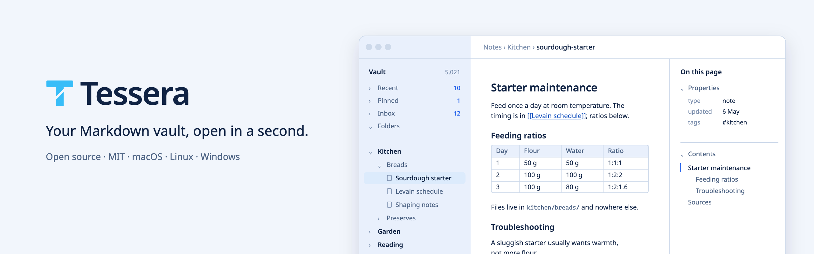
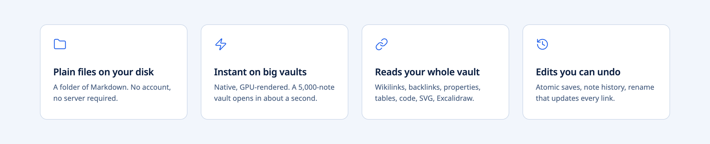
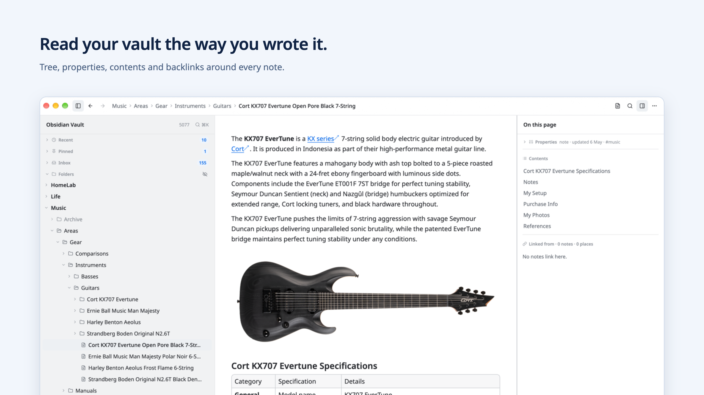
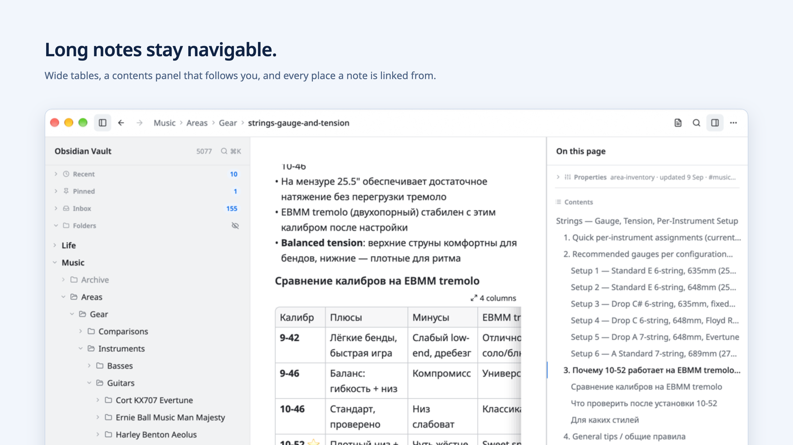

<p align="center">
  <picture>
    <source media="(prefers-color-scheme: dark)" srcset="docs/images/readme/hero-dark@2x.png">
    
  </picture>
</p>

<p align="center">
  <picture>
    <source media="(prefers-color-scheme: dark)" srcset="docs/images/readme/features-dark@2x.png">
    
  </picture>
</p>

# Tessera

Tessera is a fast, native desktop app for a folder of Markdown notes — an
Obsidian-style vault. Your notes stay ordinary files on your disk: no account,
no server, no import. Indexes and previews are rebuildable caches.

<p align="center">
  <picture>
    <source media="(prefers-color-scheme: dark)" srcset="docs/images/readme/shot-reader-dark@2x.png">
    
  </picture>
</p>

## What it does

- **Reads your whole vault.** Wikilinks and backlinks with context, frontmatter
  properties, wide tables, code with language labels, images, SVG and native
  Excalidraw drawings inside notes. Obsidian-style links with spaces, `%20` and
  absolute paths resolve the same way everywhere.
- **Finds things fast.** ⌘K quick open, full-text search, hover previews of
  linked notes, a table of contents that follows you.
- **Edits safely.** Source + preview editing with atomic saves, per-note history
  with restore, and rename/move that updates every link after showing you the
  exact changes.
- **Stays out of your way.** Opens the last vault and note on launch, remembers
  window layout, and updates itself.

<p align="center">
  <picture>
    <source media="(prefers-color-scheme: dark)" srcset="docs/images/readme/shot-tables-dark@2x.png">
    
  </picture>
</p>

## Download

| Platform | Download Beta | Stable (after first promotion) |
|---|---|---|
| macOS (Apple Silicon) | [Download ZIP](https://updates.befeast.com/tessera/macos/beta/latest.zip) · signed and notarized | [Download ZIP](https://updates.befeast.com/tessera/macos/latest.zip) |
| Windows (x64) | [Download Setup.exe](https://updates.befeast.com/tessera/windows/beta/Setup.exe) · unsigned, read-only | [Download Setup.exe](https://updates.befeast.com/tessera/windows/stable/Setup.exe) |
| Arch Linux (x86_64) | [Install beta repository](docs/linux-releases.md) | [Install stable repository](docs/linux-releases.md#stable-channel) |

[GitHub Releases and checksums](https://github.com/BeFeast/tessera/releases) ·
[macOS help](docs/macos-auto-update.md) · [Windows help](docs/windows-delivery.md)

Beta is available now. Stable downloads become available after the first
cross-platform performance approval; until then, use Beta.
GitHub's rolling **Beta** groups completed builds from the same commit; individual
platform update feeds can be newer while another platform is still building.

Tessera is under active development. Keep normal backups of your notes.

## Build from source

See [platform prerequisites and build instructions](docs/building.md).
With rustup and your platform libraries installed, Cargo automatically selects
the version and components in `rust-toolchain.toml` (currently Rust 1.99.0):

```sh
git clone https://github.com/BeFeast/tessera.git
cd tessera
bash scripts/vendor-setup.sh
bash scripts/vendor-setup.sh --verify
cargo build --release --locked -p tessera-shell
./target/release/tessera --vault /path/to/notes
```

The vendor script downloads the pinned gpui-component source and applies our
tracked patches; do not build against an unpatched upstream checkout. macOS also
needs the pinned Sparkle framework — follow the platform guide.

## Contributing

Bug reports and ideas are welcome in [GitHub issues](https://github.com/BeFeast/tessera/issues).
Pull requests are welcome too: development happens on a private Forgejo
instance and this repository mirrors `main` and releases, so accepted changes
are landed there and appear here with your authorship preserved.

The [product contract](docs/PRD.md) and [Reader design](docs/design/reader.md)
describe how Tessera is meant to behave. The workspace is split into
`tessera-core` (files, parsing, indexing, rendering model) and `tessera-shell`
(the GPUI desktop app).

## License

Tessera is licensed under the [MIT License](LICENSE). Dependencies and bundled
fonts and icons keep their own licenses — see
[third-party notices](THIRD_PARTY_NOTICES.md) and
[license sources](licenses/README.md).
